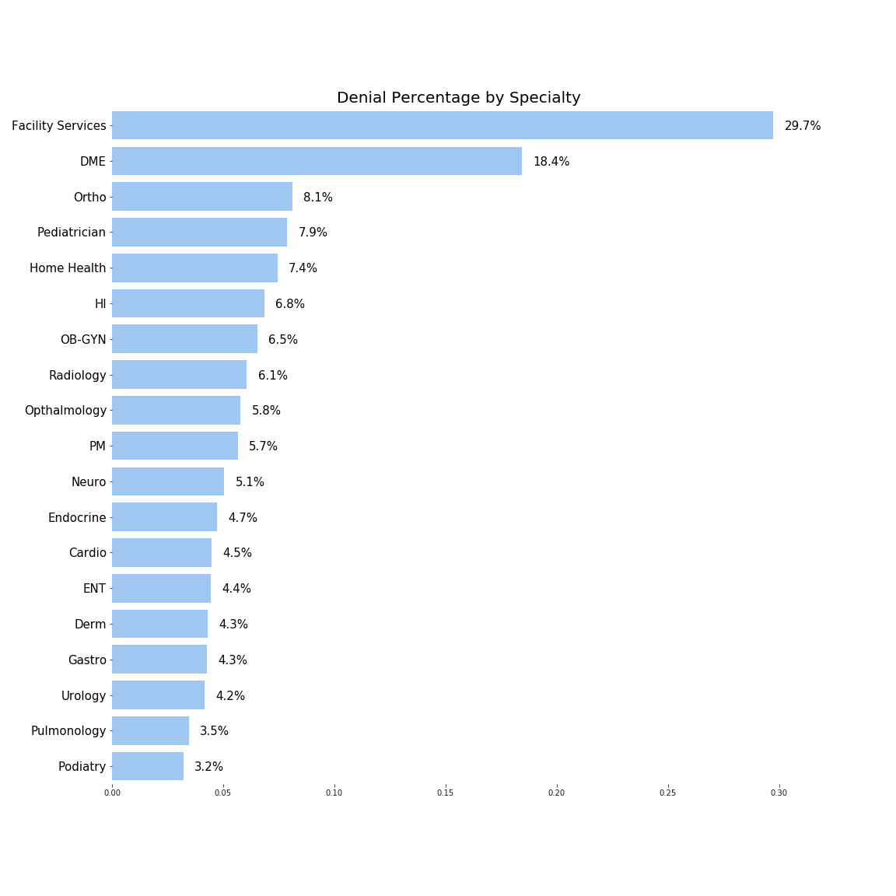
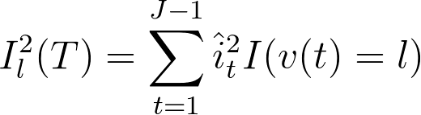
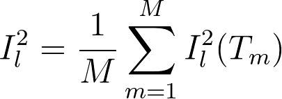
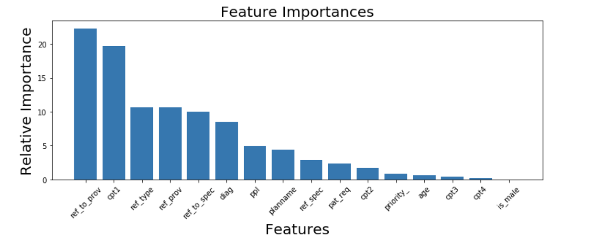

## CatBoost for Utilization Management
*Applying Catboost to classify medical referrals as "approved" or "denied".*

#### Executive Summary

The CatBoost algorithm was able identify the first 40% of referral approvals with 98% accuracy. A process for implementing the model into production is proposed.

#### Abstract

Most large healthcare provider groups are shifting from fee-for-service (FFS) models, where the group makes money each time it performs a service, to value-based models (VBM), where the group takes financial responsibility for patients from insurance companies in return for a monthly premium (PMPM). In VBM groups are more aligned with patients' long term health because they reduce costs by proactively managing patients' health today in the hopes of preventing them from becoming sick in the future.

For medical provider groups with mature VBM, there is a need to monitor what physicians and specialists are requesting for patients to ensure care provided is medically necessary and covered by the plans the group has contracted with. In addition, they need to ensure patients are being referred to a specialist who is effective and known to work with other "in-network" facilities and specialists.

This capability is called *utilization management* because the provider group is trying to manage how its patients utilize healthcare resources. The request from a physician to "utilize" resources is documented in a referral.

Health *insurers* are able to "auto-approve" referrals at very high rates because they have immediate access to "coverage of benefits" information.  For health *providers* that may contract with several insurers the process can be more onerous. A leading VBM provider group is only able to auto-approve 30% of referrals. The following is an attempt to predict whether an incoming (previously unseen) referral with approve or deny based on historical referral data.

___

#### Table of Contents
1. [Measures of Success](#measures-of-success)
2. [Data](#data)
3. [CatBoost](#catboost)
4. [Models](#models)
4. [Results](#results)
5. [Future Direction](#future-direction)

___

## Measures of Success


1. Precision at 40% auto approval rate
2. Area under the receiver operation characteristc curve
3. Incremental profit

At present the auto-approval rate for referrals is 30% - a new model would need to approve at least 40% of referrals to be worth the implementation effort. The model also needs to be precise - to have very few false positives.  This is because approving referrals that would normally be denied could be costly - worse, it could be for a treatment that isn't medically necessary for the patient.


___

## Data

Data include 2,000,000 referrals to 40 or more specialties during 2017. Each referral is either approved (93%) or denied (7%), but denial rates vary across specialty.

Name | Variable Name | Description | Type
------|----------|--------|----
**Approve** (target) | is_approve | 1 if referral approved, else 0 | bin
Date Received | dater | time / date stamp of when referral received | date
Registration Date | regdate | Date when the member registered with plan | date
Sex | is_male | 1 if male, else 0 | bin
Age | age | integer age of patient | int
Priority | priority_ | Physicians can indicate "Routine", "urgent", "emergency" | cat (4)
Patient Request | pat_req | 1 if patient requested the referral, else 0 | bin
Referring Physician | ref_prov | name of physician submitting the referral | cat (4000)
Refer "To" Physician | ref_to_prov | name of physician received the referral | cat (10000)
Specialty | ref_to_spec | E.g. "Cardiology", "Dermatology" | cat (50)
Procedure Code | cpt1, cpt2 ... | What is being requested in the referral | cat (14000)




___

## CatBoost

CatBoost was released by Yandex in 2017. While it is open source, documentation is focused on making it easy to use, and less about how it works. Key features/facts include:

* Quite good "out of the box"
* Early Stopping
* Easily handles categorical variables - hence "Cat" - Boost (see below)
* Quality output during training
* Won some Kaggle competitions
* Slower to train relative to XGBoost, and LightBoost

#### CatBoost's handling of categorical variables

CatBoost allows for categorical features to be left "as is" - it isn't necessary to one-hot-encode them. But it's important to know what's going on under the hood. The parameter `one_hot_max_size` (it accepts values 1 to 255) serves as the cut-off point for how CatBoost will treat each categorical variable. Features where the number of levels is *less than* the cutoff will be one-hot-encoded. If the number of levels is *greater than* the cutoff, CatBoost transforms them into numerical features per the following:


___

## Models

#### Logistic Regression Results

*In a prior project, logistic regression models were tested. Categorical variables (with several thousand levels) were encoded into numerical features based on each level's average of the response variable. Note that this is similar to CatBoost's treatment of categorical variables with many levels.*

AUC-ROC            |  Precision at 40%
:-------------------------:|:-------------------------:
 |  


#### CatBoost - Out of the Box

```python
model_oob = CatBoostClassifier()
```

#### CatBoost - Model 1

The tutorial from the blog *Effective ML* was used to conduct coarse and refined searches grid over the following parameters:

* `l2_leaf_reg` - Used for leaf value calculation.
* `iterations` - Number of trees
* `learning_rate` - otherwise known as shrinkage rate.
* `depth` - how deep is each tree

The result was Model 1.

```python
model1 = CatBoostClassifier(iterations=100, l2_leaf_reg=10,
learning_rate=.5, depth=3, class_weights=class_weight,
use_best_model=True, eval_metric='Accuracy')
```

#### CatBoost - Model 3

```python
model3 = CatBoostClassifier(depth=8, iterations=200, learning_rate=0.1,
l2_leaf_reg=30, class_weights=class_weight, use_best_model=True,
eval_metric='Accuracy')
```

#### CatBoost - Model 1 - production

*If the model is put into production, referrals won't be manually labeled anymore (& assumed to be accurate). Below is outline for a process to tune the model monthly using a small percentage of referrals (random selection) that are held out & manually labeled in order to continually tune the model.*


#### CatBoost - Model 11 - High iterations, low learning rate.

In *The Elements of Statistical Learning*, Hastie, Tibshirani, and Friedman (pp 361- 367) offer the following guidelines for lowering test error rates with boosting ensembles.

* **Depth** - especially when interactions between variables may be important, tree depth (J) of 3 or more is important. J = 1 doesn't allow for any interactions and J = 2 only allows for first order interactions.  In practice, 4 < J < 8 offers enough depth without compromising computational time.
* **Number of Trees** and **Learning Rate** - Empirically it has been found that smaller learning rates favor smaller test error, but must be paired with a higher number trees to reach a test error minimum. A good strategy is to set the learning rate to be very small and use early stopping to identify the right number of trees.

In addition, I added "rsm=.5" to randomly choose a subset of features to consider at each iteration, akin to Random Forest. I felt this was important as I have a high number of features dominated by two that are more important.

```python
model11 = CatBoostClassifier(depth=4, iterations=4000, learning_rate=0.01, l2_leaf_reg=20,
class_weights=class_weight, use_best_model=True, one_hot_max_size=100, rsm=.5)
```

#### Feature Importance

*The physician receiving the referral, and the first line item of what was requested appear to be more important that other variables.*

From Breiman et al. (1984), in a single tree the relevance of predictor (X) can be measured by:



As an extension, in additive models an average can be taken over many trees:



Intuitively, each time a variable is selected as an optimal split variable, it's importance increases by how much information it provided in that split.

Model 1 Feature importances:




___

## Results

|                | Test Accuracy | ROC-AUC | Precision, 40% AA | Max Profit |
|:--------------:|:-------------:|:-------:|:-----------------:|:----------:|
|   Model - OOB  |               |         |                   |            |
|     Model 1    |               |         |                   |            |
|     Model 3    |               |         |                   |            |
| Model 1 - prod |               |         |                   |            |
|    Model 11    |               |         |                   |            |

#### Receiver Operating Characteristic

*All models improved upon the logistic regression, including the model 1 on "production" data.*


#### Precision at 40% Auto Approval Rate

*All models exceed the goal of 98% precision at 40% auto-approval rate.*


#### Profit Curve

A profit curve can help us choose which threshold to set to obtain the largest amount of incremental value from our algorithm. In this case we're looking for a model that can *precisely* identify a large amount of referrals - that is, we want true positives but very, very few false positives. Below is the justification for values of the 4 possible outcomes:


|    Outcome    | Reason |
|--------|-------|
| **True Positive (TP)** | (**+$6**) Currently the provider spends money to identify approvals - if the algorithm can do it effectively the company can save this budget. |
| **False Positive (FP)** | (**-$150**) if the algorithm predicts "approve" when the referral should be denied, the company will spend money on the referral that it otherwise wouldn't. The cost will vary greatly, but we assign a somewhat liberal value of -$150 to account for this risk. |
| **False Negative (FN)** | (**-$1**) Similar to TP, if the algorithm predicts that a referral will be denied, the company will spend money to determine whether is indeed a denial. |
| **True Negative (TN)** | (**+$3**) When the algorithm effectively identifies a denial, the company can triage the referral more quickly and more effectively. This adds value. |


*Without weighted classes, "Out of the Box" slightly underperforms model 1, and offers a very small window of thresholds to maximize profit. Model 1 applied to production data slightly underperforms relatives to Model 1 and Model 3.*


___

## Future Direction

* Select most important features and fit a multi-layer perceptron neural net.
* Model change points in physicians referral rates to aide medical directors managing utilization.
* Fit individual models by specialty so the specialty-by-specialty nuances don't get washed out.


#### Acknowledgements

* [Yandex - CatBoost](https://tech.yandex.com/catboost/)
* [Effective ML - blog for gridsearch](https://effectiveml.com/using-grid-search-to-optimise-catboost-parameters.html)
* Hastie, T., Tibshirani, R., Friedman, J. (2017). *The Elements of Statistical Learning*, Springer, New York. pp. 353-371.
* Breiman, L., Friedman, J., Olshen, R. and Stone, C. (1984). *Classification and Regression Trees*, Wadsworth, New York.

#### Resources

* [Press Release: Yandex launches CatBoost](https://techcrunch.com/2017/07/18/yandex-open-sources-catboost-a-gradient-boosting-machine-learning-librar/)
